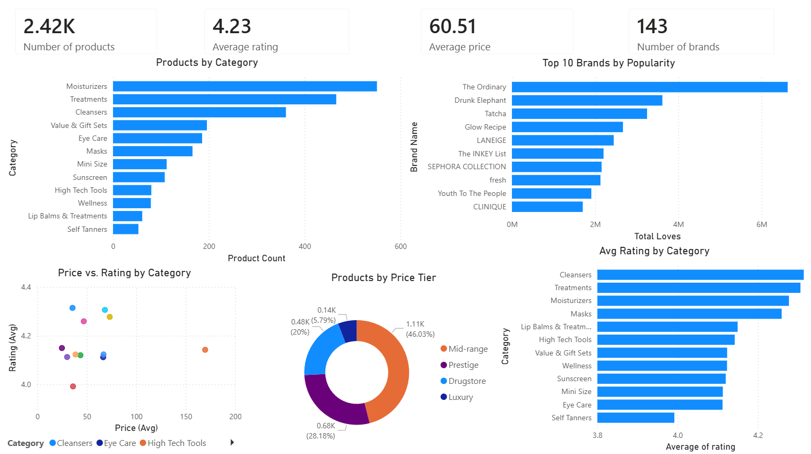

Sephora Skincare Market Analysis | Power BI Dashboard

An interactive Power BI dashboard analyzing the Sephora skincare product catalog using a publicly available Kaggle dataset (~2,400 products across 143 brands).
Key insights explored:

Product distribution across skincare categories (Moisturizers, Treatments, Cleansers, etc.)
Top 10 brands ranked by consumer popularity (loves count)
Relationship between average price and rating by category
Market share breakdown by price tier (Drugstore, Mid-range, Prestige, Luxury)
Average rating comparison across product categories

Tools: Power BI Desktop, Power Query
Data source: Sephora Products & Skincare Reviews — Kaggle

